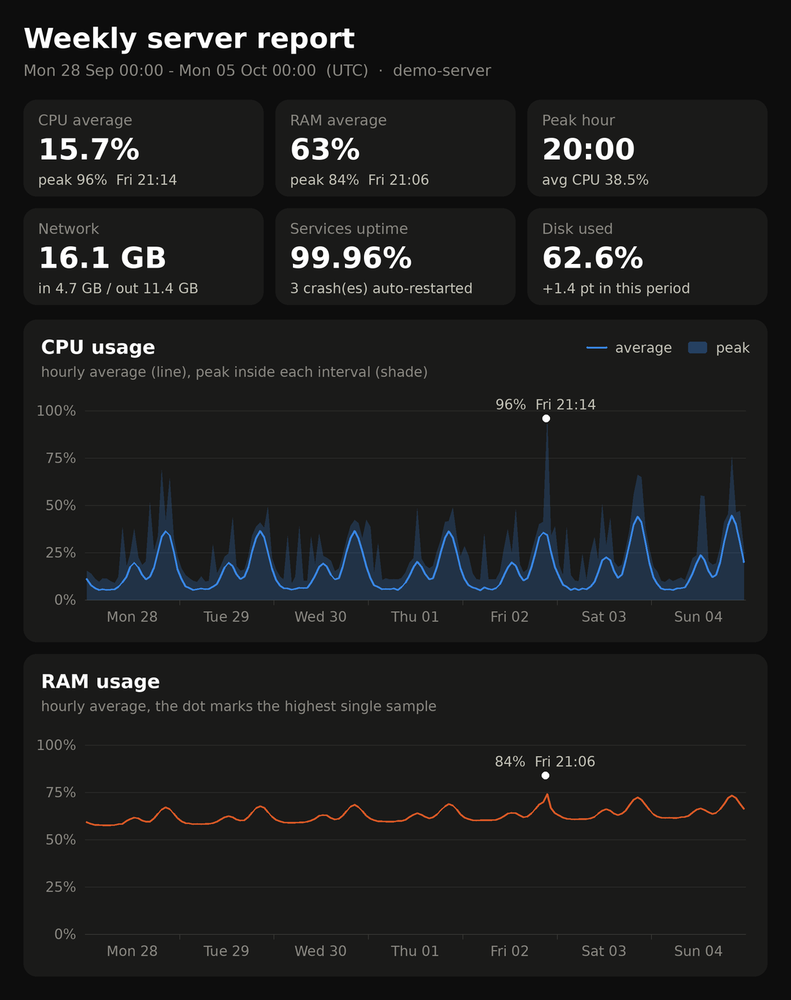
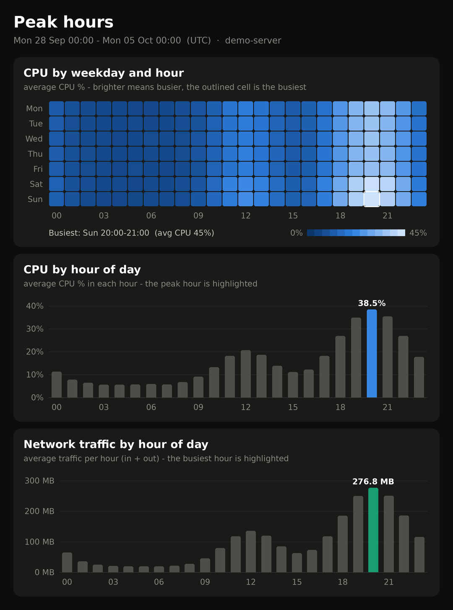
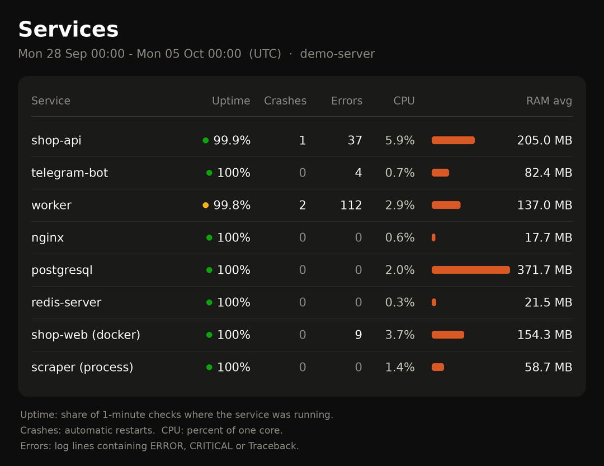
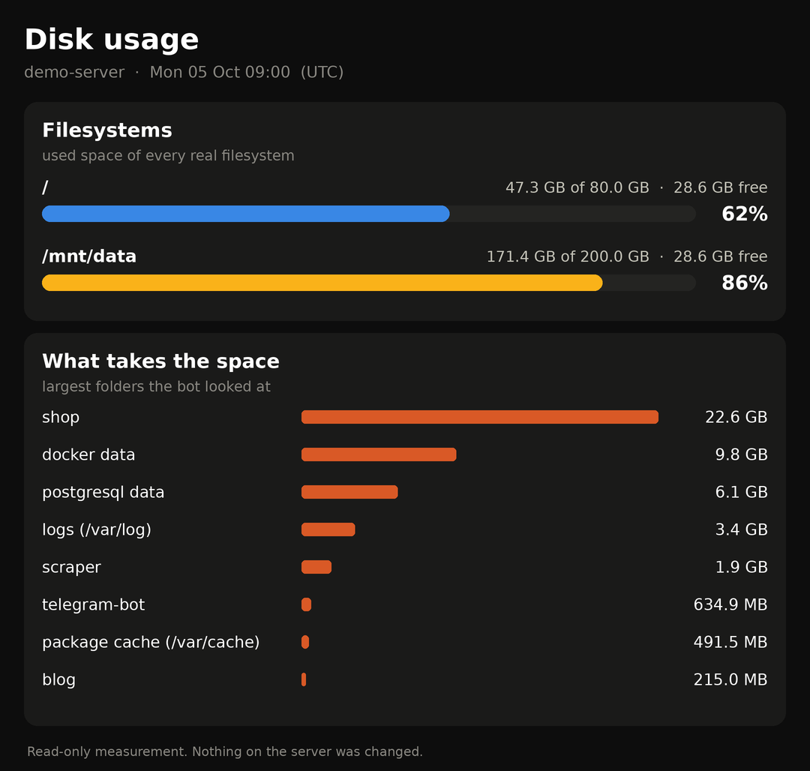
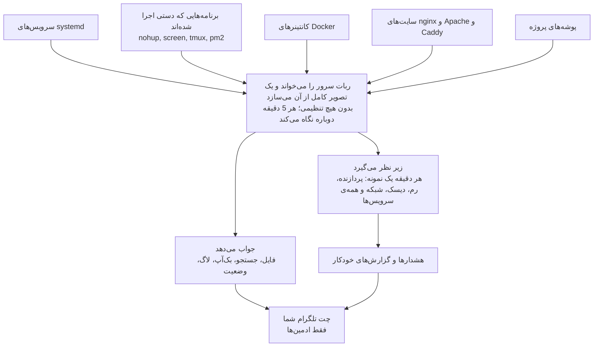

<div align="center">

# 🧰 Server Wrench — آچار سرور

**آچار جیبیِ سرور لینوکسی شما، داخل تلگرام.**

رباتی فقط‌خواندنی که خودش می‌فهمد روی سرور چه چیزهایی اجرا می‌شود، حواسش به آن‌ها هست<br>
و هر وقت بخواهید فایل، بک‌آپ، لاگ و گزارش را کف دستتان می‌گذارد.

[](https://github.com/Parsa-dude/Server-Wrench/actions/workflows/tests.yml)


[English](README.md) · **فارسی**

</div>

<p align="center">
  
  
  
</p>
<p align="center" dir="rtl"><sub>سه تصویرِ یک گزارش هفتگی. همین کدِ نمودارِ خود ربات آن‌ها را از داده‌ی نمونه کشیده است
(<a href="docs/make_samples.py">docs/make_samples.py</a>).</sub></p>

---

<div dir="rtl">

## چرا «آچار»؟

آچار لازم ندارد از قبل بداند قرار است روی کدام دستگاه کار کند. به همان مهره‌ای که جلویش است
می‌خورد، وقتی چیزی شل شد توی جیبتان است، و هیچ‌وقت سرِ خود چیزی را در دستگاه عوض نمی‌کند.

این ربات هم با همین فکر ساخته شده:

- **به هر سروری می‌خورد.** هیچ فهرستی از پروژه‌ها و سرویس‌ها داخلش نوشته نشده و لازم نیست
  چیزی را برایش تعریف کنید. فقط توکن ربات و شناسه‌ی تلگرام خودتان را می‌دهید؛ خودش سرور را
  نگاه می‌کند و بقیه را پیدا می‌کند. هفته‌ی بعد پروژه‌ی تازه‌ای بالا بیاورید، خودش در فهرست
  ظاهر می‌شود.
- **همیشه دمِ دست است.** وضعیت سرور، لاگ یک سرویس، یک فایل، بک‌آپ کامل، گزارش هفتگی: با یک
  دکمه یا یک دستور، از روی گوشی، در هر لحظه.
- **فقط می‌خواند.** هیچ‌چیز را ویرایش، ری‌استارت یا حذف نمی‌کند. با فایل سرویسی که همین‌جا
  هست، خودِ سیستم‌عامل هم جلوی نوشتن را می‌گیرد.
- **دقیق است.** عددها همان‌هایی‌اند که <code dir="ltr">df</code>، <code dir="ltr">systemctl</code> و <code dir="ltr">/proc</code> می‌دهند. دیتابیسی که داخل
  بک‌آپ می‌رود یک نسخه‌ی سالم و یکپارچه است، نه فایلی که وسط نوشتن کپی شده. سرویس بعد از دو
  بررسیِ ناموفق «از کار افتاده» اعلام می‌شود، نه با یک لحظه مکث.

## چه چیزهایی دارد

| | |
|---|---|
| 📁 **فایل‌ها** | مرور همه‌ی پروژه‌ها، پیش‌نمایش فایل‌های متنی (مقدارهای داخل <code dir="ltr">.env</code> پوشانده می‌شود)، دانلود هر فایل، جمع کردن چند فایل و پوشه در «سبد» و ارسال یکجا. |
| 🔎 **جستجو** | هر وقت خواستید بخشی از نام را تایپ کنید. غلط تایپی هم قبول است (<code dir="ltr">confg</code> فایل <code dir="ltr">config.json</code> را پیدا می‌کند)، چند کلمه نتیجه را دقیق‌تر می‌کند، و داخل فایل‌ها هم می‌شود گشت. |
| 📦 **بک‌آپ** | کل پروژه، فقط فایل‌های ضروری، فایل‌های دست‌چین، یا چند پروژه با هم. زیپ همان‌طور که ساخته می‌شود به چت شما فرستاده می‌شود؛ چیزی روی سرور نمی‌ماند. |
| 📊 **وضعیت** | پردازنده، رم، سواپ، دیسک‌ها، لود، آپتایم و هر چه از کار افتاده، در یک صفحه. |
| ⚙️ **سرویس‌ها** | سرویس‌های systemd، کانتینرهای Docker و برنامه‌هایی که دستی اجرا شده‌اند (nohup، screen، tmux، pm2)؛ هر کدام با وضعیت، مدت اجرا، مصرف رم، لاگ، «فقط خطاها»، فایل لاگ و فایل یونیت. |
| 💽 **دیسک** | هر فایل‌سیستم با یک نوار، و «چه چیزی جا گرفته؟» به تفکیک پروژه و جاهای معمول (لاگ‌ها، Docker، کش‌ها)؛ به شکل متن یا تصویر. |
| 🧮 **پردازه‌ها** | همین الان چه چیزی پردازنده و رم مصرف می‌کند و مال کدام سرویس یا پروژه است. |
| 📈 **گزارش‌ها** | نمودار 24 ساعت، 7 یا 30 روز: مصرف در طول زمان، ساعت‌های اوج، نقشه‌ی روز × ساعت، آپتایم هر سرویس، کرش‌ها و خطاهای لاگ. گزارش خودکارِ روزانه یا هفتگی هم دارد. |
| 🔔 **هشدارها** | افتادن و برگشتن سرویس، کرشِ پشت‌سرهم، کانتینر ناسالم، پر شدن دیسک یا رم، نزدیک شدن انقضای گواهی SSL، پیدا شدن پروژه یا سرویس تازه. |
| 🧾 **رخدادها** | چه بر سر سرویس‌ها آمده، و کدام ادمین چه چیزی را گرفته. |

همه‌چیز **فارسی و انگلیسی** است و هر ادمین زبان خودش را انتخاب می‌کند.

<details>
<summary><b>در چت چه شکلی است</b> (متن پیام‌ها، با داده‌ی نمونه)</summary>

```
🧰 Server Wrench · demo-server
فقط‌خواندنی: مشاهده، بک‌آپ و مانیتورینگ — هیچ چیزی روی سرور تغییر نمی‌کند.

⚙️ سرویس‌ها: 7 از 8 در حال اجرا · 🔴 1 مورد مشکل دارد

یکی را انتخاب کن 👇
[ 📁 فایل‌ها ]   [ 🔎 جستجو ]
[ 📦 بک‌آپ ]   [ 🧺 سبد (0) ]
[ 📊 وضعیت ]   [ ⚙️ سرویس‌ها ]
[ 💽 دیسک ]   [ 🧮 پردازه‌ها ]
[ 📈 گزارش‌ها ]   [ 🧾 رخدادها ]
[ 🛠 تنظیمات ]   [ ❔ راهنما ]
```

هشدارها:

<blockquote>
<div dir="auto">🔴 ⚙️ <code>worker</code> از کار افتاده (<code>failed/failed/exit-code</code>).</div>
<div dir="auto">🟢 ⚙️ <code>worker</code> دوباره بالا آمد.</div>
<div dir="auto">♻️ ⚙️ <code>shop-api</code> کرش کرد و خودکار ری‌استارت شد (بار 1).</div>
<div dir="auto">💽 دیسک <code>/mnt/data</code> <b>91٪</b> پر شده (18.0 GB خالی).</div>
<div dir="auto">🔐 گواهی SSL <code>shop.example.com</code> تا <b>7</b> روز دیگر منقضی می‌شود (2026-10-12).</div>
</blockquote>

متن زیرِ تصویرهای گزارش هفتگی:

<blockquote>
<div dir="auto">📈 <b>گزارش هفتگی سرور</b></div>
<div dir="auto">🗓 2026-09-28 00:00 → 2026-10-05 00:00 · UTC</div>
<br>
<div dir="auto"><b>منابع</b></div>
<div dir="auto">⚙️ CPU: میانگین <b>15.7٪</b> · اوج <b>96٪</b> (جمعه 21:14)</div>
<div dir="auto">🧠 رم: میانگین <b>63٪</b> · اوج <b>84٪</b> (جمعه 21:06)</div>
<div dir="auto">💽 دیسک: <b>62.6٪</b> (تغییر +1.4)</div>
<div dir="auto">🌐 ترافیک: ⬇️ <b>4.7 GB</b> · ⬆️ <b>11.4 GB</b></div>
<br>
<div dir="auto"><b>الگوی مصرف</b></div>
<div dir="auto">🔥 ساعت پیک: <b>20:00–21:00</b> (CPU 38.5٪)</div>
<div dir="auto">🌙 خلوت‌ترین ساعت: 03:00–04:00</div>
<div dir="auto">📍 شلوغ‌ترین بازه: <b>یکشنبه 20:00</b></div>
<div dir="auto">📡 پیک ترافیک: 20:00–21:00</div>
<div dir="auto">🌍 درخواست‌های سایت: <b>157,206</b> · پیک 20:00–21:00 · خطای 5xx: 42</div>
<br>
<div dir="auto"><b>سرویس‌ها</b></div>
<div dir="auto">🟢 دسترس‌پذیری: <b>99.96٪</b></div>
<div dir="auto">♻️ کرش: <b>3</b> (worker ×2, shop-api ×1) · 🔁 ری‌استارت دستی: <b>1</b></div>
<div dir="auto">❗️ خطا در لاگ‌ها: <b>162</b> (worker ×112, shop-api ×37, shop-web (docker) ×9)</div>
<br>
<div dir="auto">📊 پوشش داده: 100٪ (10,080 نمونه)</div>
</blockquote>

<p align="center"></p>

</details>

## چطور کار می‌کند؟

</div>



<div dir="rtl">

## خودش را تنظیم می‌کند

بعد از اولین اجرا، ربات خلاصه‌ای از چیزهایی که پیدا کرده برایتان می‌فرستد. از آن به بعد هر پنج
دقیقه یک بار، و هر بار که منو را باز کنید، دوباره نگاه می‌کند. این‌ها را می‌خواند:

| منبع | چه چیزی از آن می‌فهمد |
|---|---|
| فایل‌های یونیت در <code dir="ltr">/etc/systemd/system</code> | سرویس‌های خودتان و پوشه‌ای که هر کدام از آن اجرا می‌شود (<code dir="ltr">WorkingDirectory</code> و <code dir="ltr">ExecStart</code>). |
| سرویس‌های آماده‌ای که نصب و در حال استفاده‌اند | nginx، Apache، MySQL/MariaDB، PostgreSQL، Redis، Docker، php-fpm، cron، ssh و بقیه‌ی سرویس‌های رایج. |
| پردازه‌های در حال اجرا (<code dir="ltr">/proc</code>) | هر برنامه از کدام پوشه اجرا شده و مال کدام یونیت است. برنامه‌هایی که با <code dir="ltr">nohup</code>، <code dir="ltr">screen</code>، <code dir="ltr">tmux</code> یا <code dir="ltr">pm2</code> اجرا شده‌اند همین‌طور پیدا می‌شوند: چنین برنامه‌ای بعد از دو دقیقه اجرا، مثل یک سرویس زیر نظر می‌رود. |
| سوکت Docker (یا Podman) | کانتینرها، وضعیت و سلامتشان، و پوشه‌ی compose هر کدام. |
| تنظیمات nginx، Apache و Caddy | سایت‌ها، دامنه‌ها، پوشه‌ی هر سایت و گواهی‌ها. |
| پوشه‌ها | هر چیزی زیر <code dir="ltr">/root</code>، <code dir="ltr">/home/*</code>، <code dir="ltr">/srv</code>، <code dir="ltr">/var/www</code> و چند جای دیگر که شبیه پروژه باشد (فایل سورس، <code dir="ltr">Dockerfile</code>، <code dir="ltr">package.json</code> و …). پوشه‌های جاهای دیگر مثل <code dir="ltr">/opt</code> و <code dir="ltr">/usr/local</code> وقتی فهرست می‌شوند که سرویس یا برنامه‌ای از آن‌ها اجرا شود. |
| خودِ ماشین | توزیع لینوکس، نوع مجازی‌سازی (KVM، VMware، Hyper-V، LXC، Docker و …) و هر جا قابل تشخیص باشد، سرویس‌دهنده (Hetzner، DigitalOcean، AWS، Google Cloud، Azure، OVH، Vultr، Linode، Contabo و چند تای دیگر). |

هیچ‌چیز مخصوصِ یک سرورِ خاص داخل کد نیست. اگر تصویر خودکار جایی نیاز به کمک داشت، چند تنظیم
اختیاری هست (<code dir="ltr">SCAN_PATHS</code>، <code dir="ltr">EXTRA_PATHS</code>، <code dir="ltr">IGNORE_DIRS</code>، <code dir="ltr">IGNORE_SERVICES</code>) و از داخل خود ربات
هم می‌شود نام پروژه را عوض کرد، پروژه را پنهان کرد، هشدار یک سرویس را بی‌صدا کرد و فایل‌ها را
«مهم» (⭐) علامت زد.

## فقط می‌خواند

- ربات هیچ دستوری برای ویرایش، حذف، ری‌استارت یا اجرای چیزی ندارد. فقط می‌خواند و چیزی را که
  خوانده برای ادمین‌ها می‌فرستد.
- فایل سرویسی که <code dir="ltr">install.sh</code> می‌نویسد این را از «قولِ کد» به «ویژگیِ سیستم» تبدیل می‌کند: برای
  پردازه‌ی ربات **کل فایل‌سیستم فقط‌خواندنی سوار می‌شود** (<code dir="ltr">ProtectSystem=strict</code>)، به‌جز دو
  پوشه‌ی خودش یعنی <code dir="ltr">data/</code> و <code dir="ltr">.work/</code>؛ و فقط دو مجوز برایش می‌ماند: خواندن فایل‌ها صرف‌نظر از
  مالکشان، و خواندن جدول پردازه‌ها.
- فقط حساب‌های تلگرامی که در <code dir="ltr">ADMIN_IDS</code> هستند جواب می‌گیرند، آن هم فقط در چت خصوصی. به هر
  کس دیگری فقط شناسه‌ی خودش گفته می‌شود و بس.
- روی دیسک یک فایل تاریخچه‌ی کوچک نگه می‌دارد (<code dir="ltr">data/monitor.sqlite3</code>، به‌طور پیش‌فرض حداکثر
  10 مگابایت) و موقع بک‌آپ، حداکثر یک تکه از زیپ در <code dir="ltr">.work/</code> که به محض ارسال پاک می‌شود. پوشه‌ی
  کاری بعد از هر عملیات و در هر بار اجرا خالی می‌شود.
- توکن ربات و API hash هیچ‌وقت در لاگ نمی‌آیند، هر کسی که آن خط را نوشته باشد.

دو نکته که از ذاتِ خودِ این ابزار می‌آید و باید حواستان به آن باشد:

- **هر کس حساب تلگرام یک ادمین را در دست داشته باشد می‌تواند همه‌ی فایل‌های سرور را بخواند**،
  از جمله رمزها و توکن‌ها. برای آن حساب‌ها تأیید دومرحله‌ای بگذارید و فهرست <code dir="ltr">ADMIN_IDS</code> را
  کوتاه نگه دارید.
- **بک‌آپ‌ها فایل‌هایی داخل یک چت تلگرام‌اند.** به اندازه‌ی همان چت خصوصی‌اند.

## سبک روی سرور

- دقیقه‌ای یک بار یک نمونه برمی‌دارد: چند فایل کوچک از <code dir="ltr">/proc</code>، یک بار <code dir="ltr">systemctl show</code> برای
  همه‌ی سرویس‌های زیر نظر با هم، و سوکت Docker.
- ساعتی یک بار خط‌های لاگِ ساعت گذشته را می‌شمارد (تعداد خط، خطا و هشدار؛ خودِ متن نگه داشته
  نمی‌شود) و تاریخچه‌اش را هرس می‌کند.
- سرویس با پایین‌ترین اولویت پردازنده و دیسک اجرا می‌شود (<code dir="ltr">Nice=10</code>، <code dir="ltr">IOSchedulingClass=idle</code>،
  <code dir="ltr">CPUWeight=20</code>)، سقف رم دارد (<code dir="ltr">MemoryMax=400M</code>) و اگر روزی رم سرور تمام شود، اولین پردازه‌ای
  است که کنار می‌رود.
- بک‌آپ جریانی است: هیچ فایلی کامل در رم بار نمی‌شود، زیپ هیچ‌وقت یکجا روی دیسک ساخته نمی‌شود،
  و اگر فضای خالی دیسک کم باشد عملیات از همان اول رد می‌شود.

اندازه‌گیری روی یک ماشین مجازی آزمایشی با 2 هسته و پایتون 3.13: بین 50 تا 70 مگابایت رم، و برای
نمونه‌ی هر دقیقه 3 میلی‌ثانیه پردازنده روی ماشینی با حدود 20 پردازه، 25 میلی‌ثانیه با 300 پردازه و
85 میلی‌ثانیه با 1000 پردازه؛ یعنی بین 0.01 تا 0.2 درصدِ یک هسته. (این فقط کارِ خودِ ربات است؛
روی سرورهای systemd یک بار اجرای <code dir="ltr">systemctl</code> در دقیقه هم به آن اضافه می‌شود.) صفحه‌ی «وضعیت»
مصرف رم و پردازنده‌ی خودِ ربات را نشان می‌دهد تا روی سرور خودتان ببینید.

## نصب

**چه چیزهایی لازم است:** یک سرور لینوکسی با دسترسی root، پایتون 3.9 یا بالاتر (اگر نباشد
نصب‌کننده خودش می‌آورد) و یک توکن ربات از [@BotFather](https://t.me/BotFather).
**هر سرور یک ربات جدا:** دو سرور نباید یک توکن مشترک داشته باشند.

<div dir="ltr">

```bash
git clone https://github.com/Parsa-dude/Server-Wrench.git /opt/server-wrench
cd /opt/server-wrench
sudo bash install.sh
```

</div>

(اگر <code dir="ltr">git</code> روی سرور نیست: <code dir="ltr">apt install -y git</code>؛ یا مخزن را به شکل zip دانلود و در
<code dir="ltr">/opt/server-wrench</code> باز کنید.)

نصب‌کننده توکن و شناسه‌ی عددی تلگرام شما را می‌پرسد، یک محیط مجازی پایتون می‌سازد، فایل <code dir="ltr">.env</code>
(فقط قابل خواندن برای root) و یک سرویس systemd می‌نویسد، آن را اجرا می‌کند و مطمئن می‌شود بالا
مانده. بعد ربات را در تلگرام باز کنید و <code dir="ltr">/start</code> بفرستید.

شناسه‌ی تلگرامتان را نمی‌دانید؟ خالی بگذارید: تا وقتی ادمینی تعریف نشده، ربات به هر کس <code dir="ltr">/start</code>
بفرستد شناسه‌ی خودش را می‌گوید. آن را در <code dir="ltr">.env</code> بگذارید و <code dir="ltr">systemctl restart server-wrench</code> را
بزنید.

<div dir="ltr">

```bash
sudo bash install.sh --status      # وضعیت سرویس و آخرین خط‌های لاگ
sudo bash install.sh --update      # git pull، به‌روزرسانی پکیج‌ها، ری‌استارت
sudo bash install.sh --uninstall   # توقف و حذف سرویس (پوشه و داده‌ها می‌مانند)

# نصب بدون پرسش
BOT_TOKEN=123456789:AA... ADMIN_IDS=111,222 bash install.sh --yes
```

</div>

گزینه‌ها: <code dir="ltr">--big-files</code> (کتابخانه‌ی فایل حجیم هم نصب شود)، <code dir="ltr">--no-sandbox</code> (بخش فقط‌خواندنی در
فایل سرویس نوشته نشود)، <code dir="ltr">--no-start</code>.

<details>
<summary><b>نصب دستی</b>، یا سروری که systemd ندارد</summary>

<div dir="ltr">

```bash
python3 -m venv venv
venv/bin/pip install -r requirements.txt
cp .env.example .env && chmod 600 .env      # BOT_TOKEN و ADMIN_IDS را پر کنید
venv/bin/python bot.py
```

</div>

یک فایل سرویس نمونه در [<code dir="ltr">deploy/server-wrench.service</code>](deploy/server-wrench.service) هست. بدون
systemd هم ربات کانتینرها و برنامه‌های در حال اجرا را زیر نظر می‌گیرد؛ با هر ابزار مدیریت
پردازه‌ای که آن ماشین دارد اجرایش کنید.

</details>

**کجا اجرا می‌شود:** هر لینوکسی که پایتون 3.9 یا بالاتر داشته باشد. نصب‌کننده برای توزیع‌های
systemd است و <code dir="ltr">apt</code>، <code dir="ltr">dnf</code>، <code dir="ltr">yum</code>، <code dir="ltr">zypper</code> و <code dir="ltr">pacman</code> را می‌شناسد؛ Ubuntu 22.04 به بالا،
Debian 11 به بالا، RHEL / AlmaLinux / Rocky 8 به بالا، Fedora، openSUSE، Arch و Amazon Linux 2023
هر چه لازم است دارند (Ubuntu 20.04 پایتون 3.8 دارد؛ اول پایتون جدیدتر نصب کنید). کد به‌طور
خودکار روی پایتون 3.9 تا 3.14 تست می‌شود. روی تک‌تکِ توزیع‌های این فهرست اجرا نشده؛ اگر جایی
چیزی دیدید، گزارشش کمک بزرگی است.

## تنظیمات

همه در فایل <code dir="ltr">.env</code> کنار <code dir="ltr">bot.py</code> (متغیرهای محیطیِ واقعی اولویت دارند). فقط دو تای اول لازم‌اند.

| تنظیم | پیش‌فرض | معنی |
|---|---|---|
| <code dir="ltr">BOT_TOKEN</code> | — | توکنی که از @BotFather گرفته‌اید. |
| <code dir="ltr">ADMIN_IDS</code> | — | شناسه‌ی عددی کاربرانی که اجازه‌ی استفاده دارند؛ با ویرگول جدا کنید. |
| <code dir="ltr">LANGUAGE</code> | <code dir="ltr">auto</code> | یکی از <code dir="ltr">auto</code>، <code dir="ltr">en</code> یا <code dir="ltr">fa</code>. زبان هشدارها و ادمین‌هایی که هنوز زبان انتخاب نکرده‌اند. |
| <code dir="ltr">TIMEZONE</code> | مال سرور | منطقه‌ی زمانی گزارش‌ها و زمان‌بندی‌ها، مثلاً <code dir="ltr">Asia/Tehran</code>. |
| <code dir="ltr">API_ID</code> و <code dir="ltr">API_HASH</code> | — | حالت فایل حجیم را فعال می‌کند (پایین‌تر). |
| <code dir="ltr">BIG_PART_MB</code> | <code dir="ltr">1900</code> | اندازه‌ی هر تکه در حالت فایل حجیم. |
| <code dir="ltr">EXTRA_PATHS</code> | — | پوشه‌های اضافه برای مرور، مثلاً <code dir="ltr">/var/log,/backup</code>. |
| <code dir="ltr">SCAN_PATHS</code> | — | پوشه‌های مادرِ اضافه که زیرپوشه‌هایشان برای پیدا کردن پروژه بررسی می‌شود. برای جاهایی که در حالت عادی نادیده گرفته می‌شوند (مثل <code dir="ltr">/var/lib/apps</code>) هم کار می‌کند. |
| <code dir="ltr">IGNORE_DIRS</code> | — | نام پوشه‌هایی که هیچ‌وقت پروژه حساب نشوند. |
| <code dir="ltr">IGNORE_SERVICES</code> | — | سرویس‌هایی که فهرست نشوند؛ کانتینر را به شکل <code dir="ltr">d/&lt;name&gt;</code> بنویسید. |
| <code dir="ltr">SYSTEM_CONFIGS</code> | <code dir="ltr">on</code> | گروه «پوشه‌های تنظیمات» (<code dir="ltr">/etc/nginx</code>، فایل‌های یونیت، crontab و …). |
| <code dir="ltr">MAX_JOB_MB</code> | <code dir="ltr">4096</code> | بزرگ‌ترین بک‌آپ یا فایلی که یک عملیات می‌فرستد. |
| <code dir="ltr">MIN_FREE_DISK_MB</code> | <code dir="ltr">500</code> | فضای خالی دیسک که همیشه دست‌نخورده می‌ماند. |
| <code dir="ltr">DATA_MAX_MB</code> | <code dir="ltr">10</code> | سقف حجم تاریخچه‌ی مانیتورینگ. |
| <code dir="ltr">PROXY_URL</code> | — | پروکسی برای رسیدن به تلگرام (<code dir="ltr">http://…</code> یا <code dir="ltr">socks5://…</code>). |
| <code dir="ltr">BOT_API_URL</code> و <code dir="ltr">BOT_API_LIMIT_MB</code> | — / <code dir="ltr">50</code> | سرور Bot API خودتان و سقف آپلود آن. |
| <code dir="ltr">BUTTON_COLORS</code> | <code dir="ltr">on</code> | دکمه‌های رنگی؛ نسخه‌های قدیمی تلگرام آن‌ها را ساده نشان می‌دهند. |
| <code dir="ltr">LOG_LEVEL</code> | <code dir="ltr">INFO</code> | |

آستانه‌ی هشدارها، زمان گزارش خودکار، روز اول هفته و زبان از داخل خود ربات عوض می‌شوند: 🛠 تنظیمات.

## فایل‌های حجیم

ربات‌ها اجازه دارند هر فایل را تا 50 مگابایت آپلود کنند. بدون هیچ تنظیم اضافه‌ای، هر چیز بزرگ‌تر
به شکل تکه‌های شماره‌دار می‌رسد (<code dir="ltr">name.zip.001</code>، <code dir="ltr">.002</code> و …) که با 7-Zip یا دستور
<code dir="ltr">cat name.zip.* &gt; name.zip</code> دوباره یکی می‌شوند.

با یک <code dir="ltr">api_id</code> و <code dir="ltr">api_hash</code> از <https://my.telegram.org> (بخش *API development tools*) ربات
می‌تواند **یک فایل تا 2 گیگابایت** را یکجا بفرستد و چیزهای بزرگ‌تر را در تکه‌های 1.9 گیگابایتی:

<div dir="ltr">

```bash
sudo bash install.sh --big-files        # دو مقدار را می‌پرسد و Telethon را نصب می‌کند
```

</div>

یا خودتان <code dir="ltr">API_ID</code> و <code dir="ltr">API_HASH</code> را در <code dir="ltr">.env</code> بگذارید و
<code dir="ltr">venv/bin/pip install -r requirements-bigfiles.txt cryptg</code> را اجرا کنید. ربات همچنان با همان
حسابِ ربات وارد می‌شود؛ هیچ حساب شخصی‌ای در کار نیست. اگر کانال فایل حجیم در دسترس نباشد، ارسال
به همان روش تکه‌تکه برمی‌گردد. راه دیگرِ بالا بردن سقف، یک
[سرور Bot API محلی](https://github.com/tdlib/telegram-bot-api) است (<code dir="ltr">BOT_API_URL</code> و
<code dir="ltr">BOT_API_LIMIT_MB</code>).

## دستورها

منو همه‌چیز را دارد؛ دستورها میان‌بُرند.

| | |
|---|---|
| <code dir="ltr">/start</code> و <code dir="ltr">/menu</code> | منوی اصلی |
| <code dir="ltr">/status</code> | وضعیت سرور |
| <code dir="ltr">/services</code> | سرویس‌ها، کانتینرها، برنامه‌ها |
| <code dir="ltr">/logs &lt;name&gt;</code> | آخرین خط‌های لاگ یک سرویس |
| <code dir="ltr">/disk</code> | فضای دیسک |
| <code dir="ltr">/top</code> | پرمصرف‌ترین پردازه‌ها |
| <code dir="ltr">/report [days]</code> | گزارش با نمودار، مثلاً <code dir="ltr">/report 7</code> (از 1 تا 35 روز) |
| <code dir="ltr">/find &lt;words&gt;</code> | پیدا کردن فایل؛ یا فقط همان کلمه‌ها را بدون دستور تایپ کنید |
| <code dir="ltr">/backup</code> | بک‌آپ از یک پروژه |
| <code dir="ltr">/events</code> | رخدادهای اخیر |
| <code dir="ltr">/settings</code> | تنظیمات |
| <code dir="ltr">/id</code> | شناسه‌ی تلگرام شما |

## جزئیات بک‌آپ

- **کل پروژه** همه‌چیز را برمی‌دارد به‌جز محیط‌های مجازی پایتون، <code dir="ltr">node_modules</code>، <code dir="ltr">.git</code>، کش‌ها و
  فایل‌های کامپایل‌شده‌ی پایتون.
- **ضروری‌ها** یعنی سورس، تنظیمات و فایل‌های داده‌ی کوچک (هر کدام تا 25 مگابایت، تا سه لایه
  پوشه)، به‌اضافه‌ی هر فایلی که ⭐ زده باشید.
- **دیتابیس‌های SQLite** از روی محتوایشان شناخته می‌شوند (اسم فایل هر چه باشد) و به شکل یک
  نسخه‌ی یکپارچه داخل زیپ می‌روند؛ با همان backup API خودِ SQLite و در حالت فقط‌خواندنی. کنار
  دیتابیس شما هیچ فایلی ساخته نمی‌شود. اگر گرفتن نسخه‌ی یکپارچه ممکن نباشد (مثلاً فایل <code dir="ltr">-wal</code> که
  از یک کرش مانده، یا دیتابیسی که بی‌وقفه در آن نوشته می‌شود) فایل همان‌طور که هست همراه فایل
  <code dir="ltr">-wal</code> / <code dir="ltr">-journal</code> کپی می‌شود و در توضیحِ بک‌آپ هم گفته می‌شود.
- زیپ به شکل جریانی و تکه‌تکه نوشته می‌شود؛ هر تکه فرستاده و پاک می‌شود و بعد تکه‌ی بعدی نوشته
  می‌شود. قبل از شروع، فضای خالی دیسک بررسی می‌شود.
- هر بار فقط یک عملیات اجرا می‌شود، پیشرفتش را نشان می‌دهد و قابل لغو است.

## هشدارها

| هشدار | چه وقت |
|---|---|
| 🔴 از کار افتاد / 🟢 دوباره بالا آمد | یک سرویس، کانتینر یا برنامه‌ی زیر نظر دو بررسی پشت‌سرهم ناموفق باشد (حدود دو دقیقه). |
| ♻️ کرش کرد و ری‌استارت شد | systemd خودکار آن را دوباره اجرا کرده؛ برای هر سرویس حداکثر یک هشدار در 30 دقیقه. |
| 🟠 ناسالم | بررسی سلامت (health check) یک کانتینر ناموفق است. |
| 💽 دیسک | یک فایل‌سیستم به آستانه برسد (پیش‌فرض 90٪)؛ برای هر فایل‌سیستم روزی یک بار. |
| 🧠 رم | مصرف رم پنج دقیقه بالای آستانه بماند (پیش‌فرض 95٪). |
| 🔐 SSL | 14، 7، 3، 2 و 1 روز مانده به انقضای گواهی، و وقتی منقضی شد. |
| 🆕 تازه | پروژه یا سرویس تازه‌ای روی سرور پیدا شود. |

هشدارها را می‌شود یکجا خاموش کرد یا فقط برای یک سرویس بی‌صدا کرد.

## رفع اشکال

| | |
|---|---|
| سرویس بالا نمی‌آید و در لاگ کلمه‌ی <code dir="ltr">NAMESPACE</code> هست | حالت فقط‌خواندنی روی این سیستم در دسترس نیست (بعضی کانتینرها). <code dir="ltr">sudo bash install.sh --no-sandbox</code> را اجرا کنید. |
| <code dir="ltr">Telegram does not accept BOT_TOKEN</code> | توکنِ داخل <code dir="ltr">.env</code> اشتباه است. سرویس متوقف می‌ماند (کد خروج 78) تا درستش کنید و دوباره اجرا کنید. |
| <code dir="ltr">Telegram cannot be reached</code> | از این سرور راهی به تلگرام نیست. <code dir="ltr">PROXY_URL</code> را تنظیم کنید؛ برای <code dir="ltr">socks5://</code> این را هم بزنید: <code dir="ltr">venv/bin/pip install "python-telegram-bot[socks]"</code>. |
| «برنامه‌ی دیگری هم با توکن همین بات کار می‌کند» | دو نسخه با یک توکن اجرا شده‌اند، یا همان توکن روی سرور دیگری هم هست. هر سرور ربات خودش را می‌خواهد. |
| گزارش‌ها بدون تصویر می‌رسند | Pillow نصب نیست: <code dir="ltr">venv/bin/pip install pillow</code>. |
| یک پروژه در فهرست نیست | در «فایل‌ها» دکمه‌ی 🔄 «بررسی دوباره» را بزنید. اگر جای آن غیرمعمول است، پوشه‌ی مادرش را در <code dir="ltr">SCAN_PATHS</code> بنویسید. |
| چیزی فهرست شده که نباید باشد | از کارتِ همان پروژه پنهانش کنید، یا از <code dir="ltr">IGNORE_DIRS</code> / <code dir="ltr">IGNORE_SERVICES</code> استفاده کنید. |

لاگ‌ها: <code dir="ltr">journalctl -u server-wrench -f</code>

## تست‌ها

<div dir="ltr">

```bash
pip install -r requirements.txt -r requirements-bigfiles.txt
python tests/test_offline.py
```

</div>

تست‌ها نه حساب تلگرام می‌خواهند، نه اینترنت، نه root. یک سرور ساختگیِ کوچک در یک پوشه‌ی موقت
می‌سازند (پوشه‌ی پروژه‌ها، فایل‌های یونیت، یک درخت <code dir="ltr">/proc</code>، تنظیمات وب‌سرور، جواب‌های Docker
API) و کدِ واقعی ربات را از راه یک لایه‌ی HTTP ساختگی روی آن اجرا می‌کنند؛ تک‌تک پیام‌ها از نظر
درستیِ HTML تلگرام و محدودیت طول بررسی می‌شوند. در آخر هم پردازه‌ی واقعی ربات را جلوی یک
جانشینِ محلی برای Bot API اجرا می‌کنند: شروع، منو، وضعیت، یک بک‌آپ کامل روی HTTP و توقف تمیز.

چیزی که تست جای آن را نمی‌گیرد یک سرور واقعی است. چیدمان توزیع‌های مختلف با نمونه‌های ساختگی
پوشش داده شده، نه با ماشین واقعی از هر نوع؛ اگر ربات روی سرور شما چیزی را ندید، یک issue همراه
با توضیح چیدمانِ آن خیلی کمک می‌کند.

## ساختار پروژه

<div dir="ltr">

```
bot.py                        the bot — one file
install.sh                    installer / updater / uninstaller for systemd servers
deploy/server-wrench.service  reference service file
.env.example                  every setting, commented
requirements.txt              python-telegram-bot, tzdata, pillow
requirements-bigfiles.txt     telethon (optional, for big-file mode)
tests/test_offline.py         the test suite
docs/                         sample images and the script that draws them
```

</div>

## مجوز

[MIT](LICENSE) — استفاده، تغییر و توسعه‌ی آن آزاد است.

## سازنده

**پارسا رحمانی** — توسعه‌دهنده‌ی پایتون؛ ربات تلگرام، اتوماسیون و اتصال هوش مصنوعی.
[parsa-projects.ir](https://parsa-projects.ir) · [GitHub](https://github.com/Parsa-dude)

اگر این پروژه به کارتان آمد، یک ⭐ کمک می‌کند دیگران هم پیدایش کنند.

</div>
